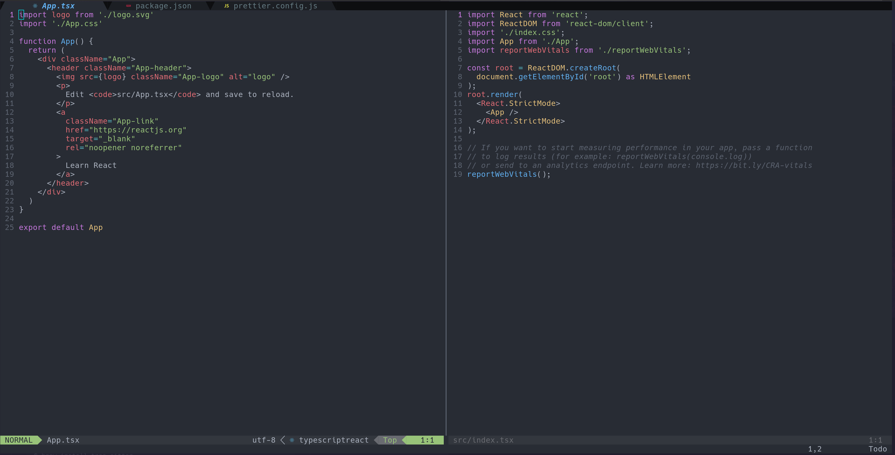

# Neovim Dotfiles



## Description

This are my personal config for Neovim, is based on <a href='https://www.youtube.com/watch?v=ajmK0ZNcM4Q&t'>devaslife</a> config.

## Dependencies

- Neovim >= 0.7
- NPM
- Brew (mac os)
- JetBrains Mono Regular Nerd Font Complete Mono (fonts folder)
- Terminal kitty

## Installation

### Mac

```
$ brew install nvim
$ brew install tree-sitter
$ brew install ripgrep
$ npm i -g typescript-language-server
$ npm i -g eslint_d
$ npm i -g @fsouza/prettierd
```

### Linux (Fedora)

```
$ sudo dnf install nvim
$ sudo dnf install tree-sitter-cli
$ sudo dnf install ripgrep
$ sudo npm i -g typescript-language-server
$ sudo npm i -g eslint_d
$ sudo npm i -g @fsouza/prettierd
```

- Copy all files from folder .config/nvim to your /${USER}/.config/nvim
- Next open Neovim to start installing the plugins
- Close Neovim and open again.

## Optional

I use lazygit for git controls, you can installed follow this <a href='https://github.com/jesseduffield/lazygit#installation'>instructions.</a>
